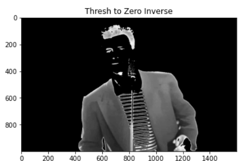

# Thresholding of Images
## Aim
To segment the image using global thresholding, adaptive thresholding and Otsu's thresholding using python and OpenCV.

## Software Required
1. Anaconda - Python 3.7
2. OpenCV

## Algorithm

### Step1:
Import packages cv2 and matplotlib.

### Step2:
Read the image and convert it into grayscale image.

### Step3:
Perform Global thresholding method.

### Step4:
Perform Adaptive thresholding method.

### Step5:
Perform optimum global thresholding by otsu method.

### Step6:
Run the programs and show the outputs.

## Program
### Developed by :Saravana Kumar S
### Register number: 212221230088
```python
# Load the necessary packages
import cv2
import matplotlib.pyplot as plt

# Read the Image and convert to grayscale
BGR_image=cv2.imread('rick_roll.jpg')
gray=cv2.cvtColor(BGR_image,cv2.COLOR_BGR2GRAY)
plt.imshow(gray)

# Use Global thresholding to segment the image
ret,thresh1=cv2.threshold(gray,100,255,cv2.THRESH_BINARY )
ret,thresh2=cv2.threshold(gray,100,255,cv2.THRESH_BINARY_INV)
ret,thresh3=cv2.threshold(gray,100,255,cv2.THRESH_TRUNC)
ret,thresh4=cv2.threshold(gray,100,255,cv2.THRESH_TOZERO)
ret,thresh5=cv2.threshold(gray,100,255,cv2.THRESH_TOZERO_INV)


# Use Adaptive thresholding to segment the image
img= cv2.GaussianBlur(gray,(3,3),0)
th1 = cv2.adaptiveThreshold(gray, 255, cv2.ADAPTIVE_THRESH_MEAN_C,cv2.THRESH_BINARY, 11,2) 
th2= cv2.adaptiveThreshold(gray, 255, cv2.ADAPTIVE_THRESH_GAUSSIAN_C,cv2.THRESH_BINARY, 11,2)
titles = ['Original Image', 'Adaptive Mean Thresholding', "Adaptive Gaussian Thresholding"]
images =[img, th1, th2]
for i in range(3):
          plt.subplot (3,1,i+1),
          plt.imshow(images[i], 'gray')
          plt.title(titles[i])
          plt.xticks([]),plt.yticks([])
          plt.show()

# Use Otsu's method to segment the image 
ret2,th2 = cv2.threshold(gray,0,255,cv2.THRESH_BINARY+cv2.THRESH_OTSU)


# Display the results
plt.imshow(thresh1,cmap='gray')
plt.title('Thresh binary')

plt.imshow(thresh2,cmap='gray')
plt.title('Thresh Binary Inverse')

plt.imshow(thresh3,cmap='gray')
plt.title('Thresh Truncate')

plt.imshow(thresh4,cmap='gray')
plt.title('Thresh to Zero')

plt.imshow(thresh5,cmap='gray')
plt.title("Thresh to Zero Inverse")

plt.imshow(th2,cmap='gray')
plt.title("Thresh By Otsu's Method")
```
## Output

### Original Image

<br>

### Global Thresholding



<br>

### Adaptive Thresholding

<br>


### Optimum Global Thesholding using Otsu's Method

<br>

## Result
Thus the images are segmented using global thresholding, adaptive thresholding and optimum global thresholding using python and OpenCV.

